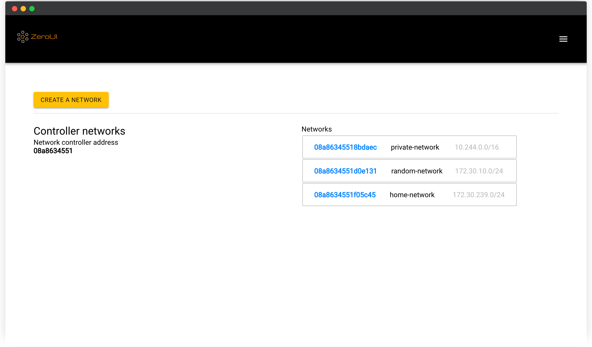

<!--
N.B.: README ini dibuat secara otomatis oleh <https://github.com/YunoHost/apps/tree/master/tools/readme_generator>
Ini TIDAK boleh diedit dengan tangan.
-->

# ZeroUI untuk YunoHost

[](https://ci-apps.yunohost.org/ci/apps/zeroui/)  

[](https://install-app.yunohost.org/?app=zeroui)

*[Baca README ini dengan bahasa yang lain.](./ALL_README.md)*

> *Paket ini memperbolehkan Anda untuk memasang ZeroUI secara cepat dan mudah pada server YunoHost.*  
> *Bila Anda tidak mempunyai YunoHost, silakan berkonsultasi dengan [panduan](https://yunohost.org/install) untuk mempelajari bagaimana untuk memasangnya.*

## Ringkasan

ZeroTier Controller Web UI is a web user interface for a self-hosted ZeroTier network controller.

This project is highly inspired by [ztncui](https://github.com/key-networks/ztncui) and was developed to address the current limitations of applying the self-hosted [network controllers](https://github.com/zerotier/ZeroTierOne/tree/master/controller). Some [ztncui](https://github.com/key-networks/ztncui) problems cannot be fixed because of the core architecture of the project. ZeroUI tries to solve them and implements the following features:

- Full React-powered lightweight [SPA](https://en.wikipedia.org/wiki/Single-page_application) that brings a better user experience, and ZeroUI is mobile-friendly.
- ZeroUI has ZeroTier Central compatible API. That means you could use CLI tools and custom applications made only for ZeroTier Central to manage your networks.
- ZeroUI implements controller-specific workarounds that address some existing [issues](https://github.com/zerotier/ZeroTierOne/issues/859). ZTNCUI [does not](https://github.com/key-networks/ztncui/issues/63).
- ZeroUI is more feature complete. ZeroUI has almost all network-controller-supported features, for example, rule editor. The development process hasn't stopped, so you will enjoy new features and bug fixes shortly.


**Versi terkirim:** 1.5.8~ynh1

## Tangkapan Layar



## :red_circle: Antifitur

- **Non-free dependencies**: Relies on software dependencies that are not free in order to run.

## Dokumentasi dan sumber daya

- Depot kode aplikasi hulu: <https://github.com/dec0dOS/zero-ui>
- Gudang YunoHost: <https://apps.yunohost.org/app/zeroui>
- Laporkan bug: <https://github.com/YunoHost-Apps/zeroui_ynh/issues>

## Info developer

Silakan kirim pull request ke [`testing` branch](https://github.com/YunoHost-Apps/zeroui_ynh/tree/testing).

Untuk mencoba branch `testing`, silakan dilanjutkan seperti:

```bash
sudo yunohost app install https://github.com/YunoHost-Apps/zeroui_ynh/tree/testing --debug
atau
sudo yunohost app upgrade zeroui -u https://github.com/YunoHost-Apps/zeroui_ynh/tree/testing --debug
```

**Info lebih lanjut mengenai pemaketan aplikasi:** <https://yunohost.org/packaging_apps>
