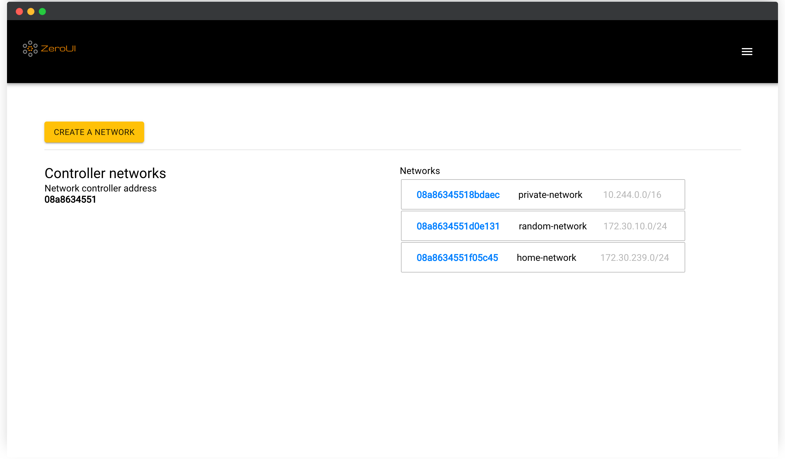

<!--
NB: Deze README is automatisch gegenereerd door <https://github.com/YunoHost/apps/tree/master/tools/readme_generator>
Hij mag NIET handmatig aangepast worden.
-->

# ZeroUI voor Yunohost

[](https://ci-apps.yunohost.org/ci/apps/zeroui/)  

[](https://install-app.yunohost.org/?app=zeroui)

*[Deze README in een andere taal lezen.](./ALL_README.md)*

> *Met dit pakket kun je ZeroUI snel en eenvoudig op een YunoHost-server installeren.*  
> *Als je nog geen YunoHost hebt, lees dan [de installatiehandleiding](https://yunohost.org/install), om te zien hoe je 'm installeert.*

## Overzicht

ZeroTier Controller Web UI is a web user interface for a self-hosted ZeroTier network controller.

This project is highly inspired by [ztncui](https://github.com/key-networks/ztncui) and was developed to address the current limitations of applying the self-hosted [network controllers](https://github.com/zerotier/ZeroTierOne/tree/master/controller). Some [ztncui](https://github.com/key-networks/ztncui) problems cannot be fixed because of the core architecture of the project. ZeroUI tries to solve them and implements the following features:

- Full React-powered lightweight [SPA](https://en.wikipedia.org/wiki/Single-page_application) that brings a better user experience, and ZeroUI is mobile-friendly.
- ZeroUI has ZeroTier Central compatible API. That means you could use CLI tools and custom applications made only for ZeroTier Central to manage your networks.
- ZeroUI implements controller-specific workarounds that address some existing [issues](https://github.com/zerotier/ZeroTierOne/issues/859). ZTNCUI [does not](https://github.com/key-networks/ztncui/issues/63).
- ZeroUI is more feature complete. ZeroUI has almost all network-controller-supported features, for example, rule editor. The development process hasn't stopped, so you will enjoy new features and bug fixes shortly.


**Geleverde versie:** 1.5.8~ynh1

## Schermafdrukken



## :red_circle: Anti-eigenschappen

- **Non-free dependencies**: Relies on software dependencies that are not free in order to run.

## Documentatie en bronnen

- Upstream app codedepot: <https://github.com/dec0dOS/zero-ui>
- YunoHost-store: <https://apps.yunohost.org/app/zeroui>
- Meld een bug: <https://github.com/YunoHost-Apps/zeroui_ynh/issues>

## Ontwikkelaarsinformatie

Stuur je pull request alsjeblieft naar de [`testing`-branch](https://github.com/YunoHost-Apps/zeroui_ynh/tree/testing).

Om de `testing`-branch uit te proberen, ga als volgt te werk:

```bash
sudo yunohost app install https://github.com/YunoHost-Apps/zeroui_ynh/tree/testing --debug
of
sudo yunohost app upgrade zeroui -u https://github.com/YunoHost-Apps/zeroui_ynh/tree/testing --debug
```

**Verdere informatie over app-packaging:** <https://yunohost.org/packaging_apps>
